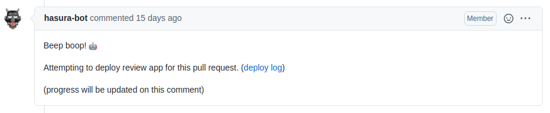

# Comment Progress

[](https://github.com/hasura/comment-progress/actions/workflows/test.yml)

GitHub Action to notify progress with GitHub Issue/PR comment(s).

Commenting inspired  by GitHub bots like [netlify](https://github.com/apps/netlify), [sonarcloud](https://github.com/apps/sonarcloud) etc.

Used at Hasura to relay progress of long running GitHub Action workflows on a pull request.

Example: when deploying preview app for a pull request

The GitHub workflow starts by commenting 



As the job progresses and if there is a failure at some step, the bot appends the updates about failure in the same comment and fails the GitHub workflow.


If the workflow succeeds, the bot comments the details of the preview environment. (configurable to be a new comment or an update to the previous comment that reported the progress)


## Usage
```yml
- uses: hasura/comment-progress@v2
  with:
    # The GitHub token to be used when creating/updating comments
    # ${{ secrets.GITHUB_TOKEN }} is provided by default by GitHub actions
    github-token: ${{ secrets.GITHUB_TOKEN }}

    # The repository to which the pull request or issue belongs to
    # ${{ github.repository }} gives the slug of the repository on which the action is running
    repository: 'my-org/my-repo'

    # The pull request or issue number on which the comment should be made 
    number: ${{ github.event.number }}

    # Friendly identifier denoting the context of the comment
    # This id is hidden on the comment made and used for referring the same comment afterwards.
    id: deploy-progress

    # Markdown message to be used for commenting
    message: 'Thank you for opening this PR :pray:'

    # Comments on the PR/issue and fails the job
    fail: true

    # Appends the message to a comment that already exits with the given id.
    # If a comment with the given id is not found, a new comment is created
    append: true

    # Deletes all the existing comments matching the given id and
    # creates a new comment with the given message
    recreate: true
```

## Scenarios
- Make a simple comment on an issue or pull request
- Make a comment and append updates to the same comment
- Delete older/stale comment and add a new comment

### Make a simple comment on an issue or pull request

Making a simple thank you comment via the github-actions user whenever a pull request is opened.

```yml
on:
  pull_request:
    types: [opened]
    
jobs:
  thank-user:
    runs-on: ubuntu-20.04
    name: Say thanks for the PR
    steps:
      - name: comment on the pull request
        uses: hasura/comment-progress@v2
        with:
          github-token: ${{ secrets.GITHUB_TOKEN }}
          repository: 'my-org/my-repo'
          number: ${{ github.event.number }}
          id: thank-you-comment
          message: 'Thank you for opening this PR :pray:'
```


### Make a comment and append updates to the same comment

This makes use of the `append` flag to add the message to the end of an already existing comment that was made with the same id.

```yml
on:
  pull_request:
    types: [opened]
    
jobs:
  deploy-preview:
    runs-on: ubuntu-20.04
    name: Deploy preview
    steps:
      - name: Notify about starting this deployment 
        uses: hasura/comment-progress@v2
        with:
          github-token: ${{ secrets.GITHUB_TOKEN }}
          repository: 'my-org/my-repo'
          number: ${{ github.event.number }}
          id: deploy-preview
          message: 'Starting deployment of this pull request.'

      - name: Deploy preview
        run: |
          echo "deploy preview"
          # long running step

      - name: Notify about the result of this deployment 
        uses: hasura/comment-progress@v2
        with:
          github-token: ${{ secrets.GITHUB_TOKEN }}
          repository: 'my-org/my-repo'
          number: ${{ github.event.number }}
          id: deploy-preview
          message: 'Deployment of a preview for this pull request was successful.'
          append: true 
```

### Delete older/stale comment and add a new comment

Take a case where you need to re-deploy a preview for your pull request and report the status of the redeployment as a new comment and at the same time delete the old comment containing stale information. `recreate` flag will help in achieving this scenario.

```yml
on:
  workflow_dispatch
    
jobs:
  deploy-preview:
    runs-on: ubuntu-20.04
    name: Deploy preview
    steps:
      - name: Notify about starting this deployment 
        uses: hasura/comment-progress@v2
        with:
          github-token: ${{ secrets.GITHUB_TOKEN }}
          repository: 'my-org/my-repo'
          number: ${{ github.event.number }}
          id: deploy-preview
          message: 'Starting deployment of this pull request.'

      - name: Deploy preview
        run: |
          echo "deploy preview"
          # long running step

      - name: Notify about the result of this deployment 
        uses: hasura/comment-progress@v2
        with:
          github-token: ${{ secrets.GITHUB_TOKEN }}
          repository: 'my-org/my-repo'
          number: ${{ github.event.number }}
          id: deploy-preview
          message: 'Deployment of a preview for this pull request was successful.'
          recreate: true 
```